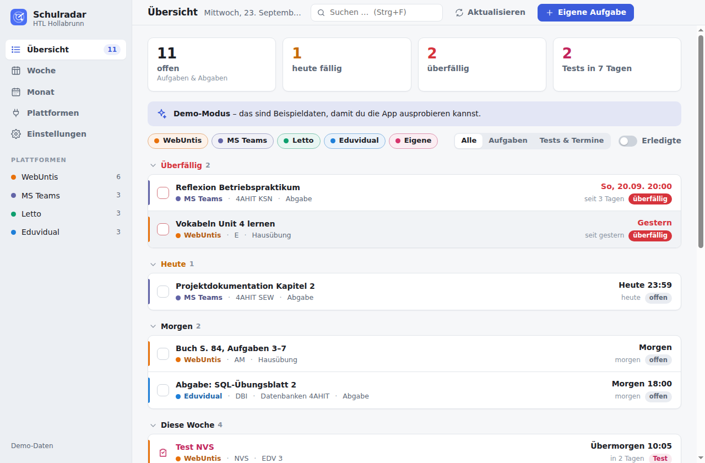
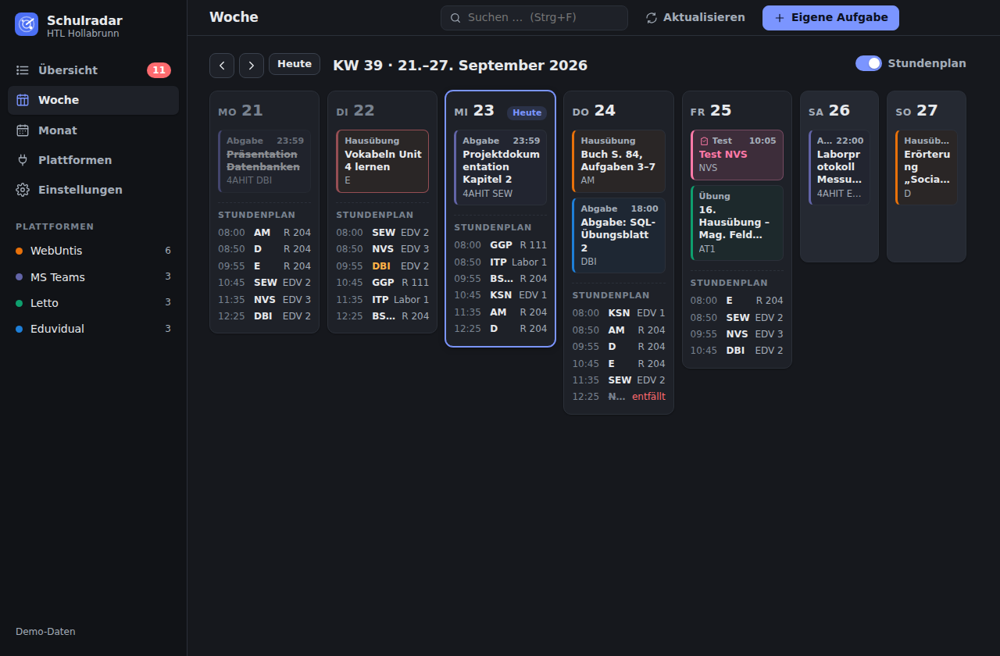
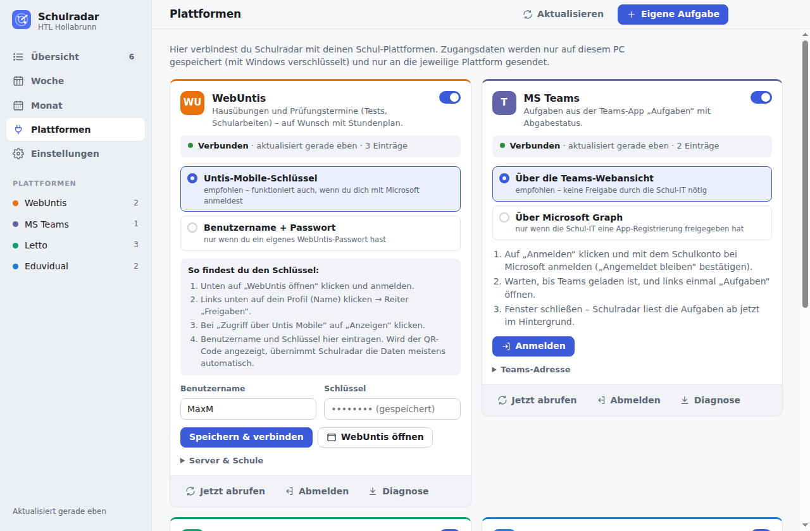

# Schulradar

**Alle Aufgaben, Abgaben und Tests aus WebUntis, MS Teams, Letto und Eduvidual in einer Übersicht.**

Bei uns in der Schule kommen Aufgaben, Aufträge und Testtermine über vier verschiedene Plattformen.
Um sicher zu sein, dass wirklich alles erledigt ist, musste man bisher alle vier einzeln durchsehen.
Schulradar ist eine Windows-App, die das automatisch erledigt: Sie holt alle Einträge im Hintergrund ab,
zeigt sie in **einer** Liste sortiert nach Fälligkeit, erkennt, was schon abgegeben ist, und erinnert
rechtzeitig an Abgaben und Tests.

Voreingestellt für die **HTL Hollabrunn**; für andere Schulen lassen sich alle Adressen ändern.



| Wochenansicht mit Stundenplan (dunkles Design) | Plattformen verbinden |
|---|---|
|  |  |

## Was Schulradar kann

- **Eine Liste für alles**: Überfällig, Heute, Morgen, Diese Woche, Nächste Woche, Später, jeweils mit
  Plattform, Fach bzw. Kurs, Art (Hausübung, Abgabe, Übung, Test …) und Status
  (*offen*, *überfällig*, *abgegeben*, *bewertet*, *erledigt*)
- **Abgabestatus automatisch**: Was in Teams oder Eduvidual abgegeben ist, wird automatisch als erledigt
  angezeigt. Verschwindet eine Übung aus dem Letto-Dashboard, gilt sie als erledigt.
- **Selbst abhaken**: Alles lässt sich zusätzlich in der App abhaken.
- **Tests & Schularbeiten** aus WebUntis werden hervorgehoben (auch „Tests in 7 Tagen“ oben).
- **Wochen- und Monatsansicht**, in der Woche auf Wunsch mit dem Stundenplan aus WebUntis
  (Entfall wird durchgestrichen).
- **Eigene Aufgaben** für Dinge, die nur mündlich angesagt wurden.
- **Erinnerungen** als Windows-Benachrichtigung: am Vorabend von Tests und ganztägigen Abgaben,
  1 Tag und 3 Stunden vor Abgaben mit Uhrzeit, jeden Morgen eine kurze Übersicht. Alles einstellbar.
- **Läuft im Hintergrund**: startet mit Windows, ruft alle 30 Minuten ab und sitzt als Symbol im Infobereich.
- Suche (Strg+F), Filter nach Plattform und Art, helles und dunkles Design.

## Installation

1. Den Installer **`Schulradar-Setup-x.y.z.exe`** herunterladen: unter *Releases* bzw. im neuesten Lauf
   von *Actions → Schulradar* das Artefakt „Schulradar-Windows“.
   Es gibt auch **`Schulradar-x.y.z-portable.exe`**, eine Version ohne Installation, etwa für einen USB-Stick.
   Windows-Benachrichtigungen funktionieren aber am zuverlässigsten mit der installierten Version.
2. Doppelklick. Es sind **keine Administratorrechte** nötig, installiert wird nur für den eigenen Benutzer.
3. Kommt die Meldung *„Der Computer wurde durch Windows geschützt“*: auf **Weitere Informationen → Trotzdem
   ausführen** klicken. Die Meldung erscheint, weil die App nicht mit einem kostenpflichtigen Zertifikat
   signiert ist.

Beim ersten Start erklärt eine kurze Einführung alles. Mit **„Erst mal Demo ansehen“** kann man die App
mit Beispieldaten ausprobieren, ohne sich irgendwo anzumelden.

## Plattformen verbinden (einmalig)

Alles passiert in der App unter **Plattformen**. Anmeldungen laufen immer über die **echte Login-Seite** der
jeweiligen Plattform in einem App-Fenster. Deshalb funktioniert auch „Mit Microsoft anmelden“ mit
Zwei-Faktor-Bestätigung. Alle Plattformen teilen sich diese Anmeldung: Wer einmal bei Microsoft angemeldet
ist, muss das meist nicht noch einmal tun.

### WebUntis: Hausübungen, Prüfungen, Stundenplan
Am zuverlässigsten ist der **Untis-Mobile-Schlüssel**. Er funktioniert auch, wenn man sich sonst mit
Microsoft anmeldet:
1. **WebUntis öffnen** klicken und anmelden.
2. Links unten auf das eigene Profil klicken, dann den Reiter **Freigaben** öffnen.
3. Bei **Zugriff über Untis Mobile** auf **Anzeigen** klicken.
4. Benutzername und Schlüssel in Schulradar eintragen und **Speichern & verbinden** klicken.
   Wird der QR-Code angezeigt, übernimmt Schulradar die Daten meist von selbst.

Wer ein eigenes WebUntis-Passwort hat, kann stattdessen Benutzername und Passwort verwenden.

### Eduvidual: Abgaben, Tests (Quiz), Kurstermine
**Anmelden** klicken und wie gewohnt einloggen, egal ob mit eduvidual-Konto, Microsoft oder Google. Schulradar
richtet danach selbst den offiziellen Moodle-App-Zugang ein und schließt das Fenster. Danach ist keine
erneute Anmeldung nötig.

### MS Teams: Aufgaben mit Abgabestatus
**Anmelden** klicken, mit dem Schulkonto anmelden und „Angemeldet bleiben“ bestätigen. Danach in Teams
einmal **Aufgaben** öffnen und das Fenster schließen. Schulradar öffnet Teams ab dann unsichtbar im
Hintergrund und liest die Aufgabenliste mit, die Teams selbst lädt.

*Optional:* Hat die Schul-IT eine App-Registrierung für Microsoft Graph freigegeben, kann man stattdessen
„Über Microsoft Graph“ wählen und die Client-ID eintragen. Die Schul-IT braucht dafür eine App-Registrierung als
öffentlicher Client mit Gerätecode-Fluss und den delegierten Berechtigungen `EduAssignments.ReadBasic`
und `EduRoster.ReadBasic` samt Administratorzustimmung.

### Letto: Übungen mit Abgabefrist
1. **Anmelden** klicken und bei Letto einloggen.
2. Einmal das **Dashboard** öffnen. Schulradar merkt sich die Seite.
3. Fenster schließen.

Letto meldet nach 20 Minuten automatisch ab. Damit der Abruf im Hintergrund trotzdem klappt, kann man
Benutzername und Passwort für Letto speichern. Wer sich bei Letto mit Microsoft anmeldet, lässt die Felder
leer: Schulradar nutzt dann die Microsoft-Anmeldung.

## Datenschutz & Sicherheit

- Schulradar hat **keinen eigenen Server**. Die App spricht nur direkt mit WebUntis, Microsoft/Teams, Letto
  und Eduvidual.
- Alle Daten bleiben auf dem eigenen PC: `%APPDATA%\Schulradar\schulradar-daten.json`.
- Passwörter, Schlüssel und Tokens werden mit der **Windows-Verschlüsselung (DPAPI)** gespeichert
  (`zugangsdaten.bin`). Nur der eigene Windows-Benutzer kann sie entschlüsseln.
- **Einstellungen → Alles zurücksetzen** löscht Daten, Zugangsdaten und alle Anmeldungen.

## Wenn etwas nicht klappt

- Unter **Plattformen** steht bei jeder Plattform, ob sie verbunden ist und was zuletzt schiefging.
- **Jetzt abrufen** probiert es sofort noch einmal.
- **Diagnose** speichert ein Protokoll des letzten Abrufs, ohne Passwörter, aber mit Aufgabentiteln. Bitte vor
  dem Weitergeben kurz durchsehen. Damit lassen sich Änderungen auf den Plattformen schnell nachbessern.

Gut zu wissen: Teams und Letto haben keine offizielle Schnittstelle für Schüler. Ändert Microsoft oder Letto
die Webseite, kann es sein, dass Schulradar dort angepasst werden muss. WebUntis und Eduvidual nutzen die
Schnittstellen, die auch die offiziellen Handy-Apps verwenden.

## Bedienung in Kürze

| Taste | Funktion |
|---|---|
| Strg+N | eigene Aufgabe anlegen |
| Strg+F | suchen |
| Strg+R / F5 | alle Plattformen jetzt abrufen |
| Strg+1 … 5 | Übersicht, Woche, Monat, Plattformen, Einstellungen |
| Esc | Dialog schließen |

Ein Klick auf einen Eintrag zeigt Details (Beschreibung, Lehrkraft, Raum …) und öffnet ihn auf der
Plattform, wahlweise im App-Fenster (bereits angemeldet) oder im normalen Browser.

---

## Für Entwickler

Electron-App ohne Frontend-Framework (reines HTML/CSS/JS), Node ≥ 22.

```bash
cd schulradar
npm install
npm start          # App starten
npm run demo       # mit Beispieldaten starten (ohne Anmeldung)
npm test           # Unit-Tests (Parser, Datum, Status, Erinnerungen, Speicher)
npm run test:e2e   # startet die echte App gegen nachgebaute Plattformen (unter Linux mit xvfb)
npm run dist       # Windows-Installer + portable Version nach dist/ (unter Windows)
npm run icons      # App-Symbole neu erzeugen
```

Den Windows-Installer baut GitHub Actions (`.github/workflows/schulradar.yml`) bei jedem Push. Ein Tag
`schulradar-vX.Y.Z` erzeugt zusätzlich ein Release mit Installer und portabler Version.

```
src/main/            Hauptprozess (Node)
  main.js            Fenster, Infobereich, IPC, Autostart
  sync.js            Abruf aller Plattformen, Zeitplan, Diagnose
  store.js           lokale JSON-Datei
  secrets.js         Zugangsdaten (Electron safeStorage / DPAPI)
  reminders.js       Erinnerungen & Morgen-Übersicht
  web.js             gemeinsame Browser-Sitzung, unsichtbare Fenster, JSON-Mitschnitt (DevTools-Protokoll)
  login.js           Anmeldefenster
  connectors/        webuntis.js, eduvidual.js, teams.js, letto.js (+ demo.js)
src/preload/         sichere Brücke zur Oberfläche
src/renderer/        Oberfläche (ES-Module): app.js, logic.js, views/*
test/                node:test-Tests, test/e2e/ mit Mock-Server
```

| Plattform | Anmeldung | Datenquelle |
|---|---|---|
| WebUntis | Untis-Mobile-Schlüssel (TOTP) oder Passwort | `/WebUntis/api/homeworks/lessons`, `/api/exams`, `/api/public/timetable/weekly/data` |
| Eduvidual | Browser-Login → Moodle-App-Token über `admin/tool/mobile/launch.php` | Moodle-Webservice: `core_calendar_get_action_events_by_timesort`, `core_calendar_get_calendar_monthly_view` (Fallback: Browser-Sitzung + `lib/ajax/service.php`) |
| MS Teams | Browser-Login (Microsoft) | Aufgaben-App unsichtbar laden und JSON-Antworten mitlesen; optional Microsoft Graph `education/me/assignments` |
| Letto | Browser-Login, optional gespeichertes Passwort / Microsoft | Schüler-Dashboard („Offene“ und „Nicht gestartete Aktivitäten“) auslesen |

Nur für Tests gibt es die Umgebungsvariablen `SCHULRADAR_USERDATA` (anderer Datenordner),
`SCHULRADAR_SCREENSHOT` / `SCHULRADAR_VIEWS` (Screenshots speichern) und `SCHULRADAR_E2E` (Abruf ausführen
und Ergebnis speichern).
